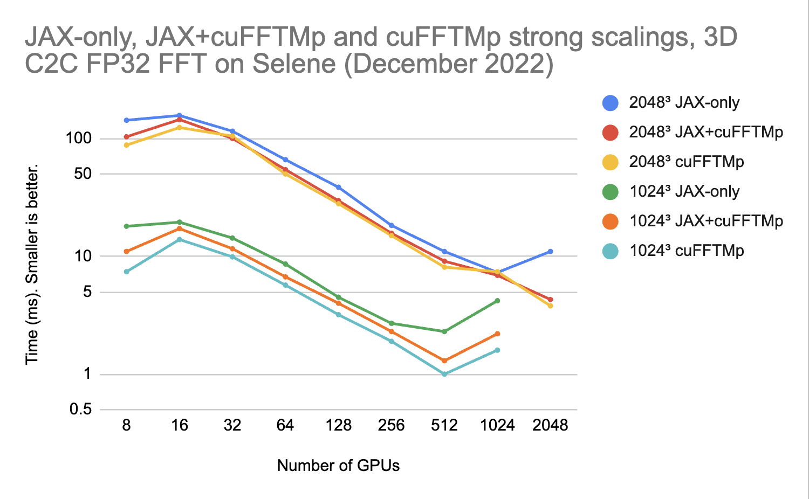
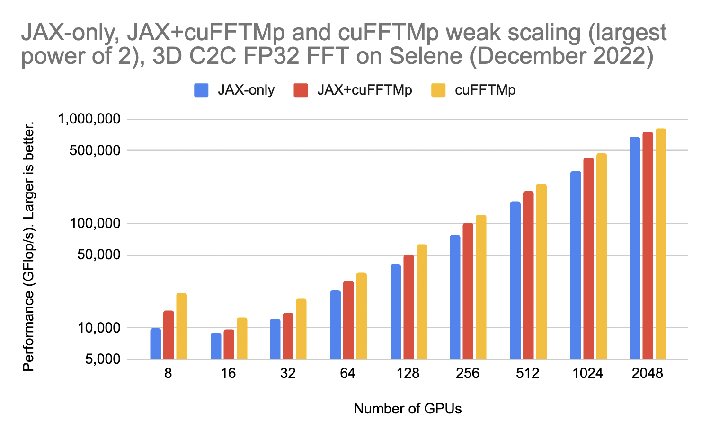

# base Nvidia FFT + JAX project implement R2C and C2R (float and double)

install cmd:
CMAKE_PREFIX_PATH=/opt/nvidia/hpc_sdk/Linux_x86_64/23.3/cmake pip install -e . -i https://pypi.tuna.tsinghua.edu.cn/simple

## Copyright

Copyright (c) 2022 NVIDIA CORPORATION AND AFFILIATES.  All rights reserved.

```
  Redistribution and use in source and binary forms, with or without modification, are permitted
  provided that the following conditions are met:
      * Redistributions of source code must retain the above copyright notice, this list of
        conditions and the following disclaimer.
      * Redistributions in binary form must reproduce the above copyright notice, this list of
        conditions and the following disclaimer in the documentation and/or other materials
        provided with the distribution.
      * Neither the name of the NVIDIA CORPORATION nor the names of its contributors may be used
        to endorse or promote products derived from this software without specific prior written
        permission.

  THIS SOFTWARE IS PROVIDED BY THE COPYRIGHT HOLDERS AND CONTRIBUTORS "AS IS" AND ANY EXPRESS OR
  IMPLIED WARRANTIES, INCLUDING, BUT NOT LIMITED TO, THE IMPLIED WARRANTIES OF MERCHANTABILITY AND
  FITNESS FOR A PARTICULAR PURPOSE ARE DISCLAIMED. IN NO EVENT SHALL NVIDIA CORPORATION BE LIABLE
  FOR ANY DIRECT, INDIRECT, INCIDENTAL, SPECIAL, EXEMPLARY, OR CONSEQUENTIAL DAMAGES (INCLUDING,
  BUT NOT LIMITED TO, PROCUREMENT OF SUBSTITUTE GOODS OR SERVICES; LOSS OF USE, DATA, OR PROFITS;
  OR BUSINESS INTERRUPTION) HOWEVER CAUSED AND ON ANY THEORY OF LIABILITY, WHETHER IN CONTRACT,
  STRICT LIABILITY, OR TOR (INCLUDING NEGLIGENCE OR OTHERWISE) ARISING IN ANY WAY OUT OF THE USE
  OF THIS SOFTWARE, EVEN IF ADVISED OF THE POSSIBILITY OF SUCH DAMAGE.
```

# FFT + JAX

This code sample shows how to compute FFTs at scale with JAX.

Specifically, it shows how to do multi-GPUs-multi-nodes (MGMN) FFTs in two ways
1. `JAX-only`: using JAX-only tools: `jax.numpy.fft`, `custom_partitioning` and `pjit`. Those are all out-of-the-box JAX APIs.
2. `JX+cuFFTMp`: using [cuFFTMp](https://docs.nvidia.com/hpc-sdk/cufftmp/index.html), a MGMN extension to [cuFFT](https://docs.nvidia.com/cuda/cufft/) based on [NVSHMEM](https://docs.nvidia.com/nvshmem/api/) which supports distributed FFTs with one-GPU-per-process. This is done using a JAX distributed-memory custom operation.


# Quick start (with Docker)

1. Clone the repo
2. Install [cuFFTMp](https://docs.nvidia.com/hpc-sdk/cufftmp/index.html) in `./cufftmp` and [NVSHMEM](https://docs.nvidia.com/nvshmem/api/) in `./nvshmem`. This means `nvshmem.h` should be in `./nvshmem/include`, `libnvshmem_host.so` should be in `./nvshmem/lib`, `cufftMp.h` should be in `./cufftmp/include` and `libcufftMp.so` should be in `./cufftmp/lib`.

    - cuFFTMp is available in the HPC SDK which can be downloaded [here](https://developer.nvidia.com/nvidia-hpc-sdk-downloads). This sample was tested with cuFFTMp 11.0.5 @ CUDA 11. Note that each version of cuFFTMp is compatible only with specific versions of NVSHMEM, see [here](https://docs.nvidia.com/hpc-sdk/cufftmp/usage/nvshmem_and_cufftmp.html#).

    - NVSHMEM can be downloaded [here](https://developer.download.nvidia.com/compute/redist/nvshmem/). This sample was tested with NVSHMEM 2.8 @ CUDA 11, which can be downloaded from [here](https://developer.download.nvidia.com/compute/redist/nvshmem/2.8.0/builds/cuda11.8/txz/rhel8/x64/).

3. Build
```
$ docker build -t fft_jax .
```
4. Assuming 4 GPUs are available on the machine, the following runs a performance test on `512 x 512 x 512` tensor with the `JAX+cuFFTMp` implementation
```
$ docker run --gpus all fft_jax mpirun -n 4 python3 /fft_jax/tests/fft_test.py cufftmp perf -n 512 --multiprocess=bootstrap
...
cufftmp (perf): (512, 512, 512), num GPUs 4, num processes 4, relative L2 error 0.00e+00, cycles 10, time 3.74e+00 ms, perf 4.84e+03 GFlop/s, bandwidth 7.18e+01 GB/s/GPU
&&&& PASSED
```
This shows that it took in average `3.7ms` to run each FFT, with an overall throughput of `4.8 TFlop/s`.

To run using a `JAX-only` implementation, `xfft`,
```
$ docker run --gpus all fft_jax mpirun -n 4 python3 /fft_jax/tests/fft_test.py xfft perf -n 512 --multiprocess=bootstrap
...
xfft (perf): (512, 512, 512), num GPUs 4, num processes 4, relative L2 error 0.00e+00, cycles 10, time 3.73e+00 ms, perf 4.86e+03 GFlop/s, bandwidth 7.19e+01 GB/s/GPU
&&&& PASSED
```
where we see that performances are very similar.

# Quick start (without Docker)

1. Perform step #1 and #2 as described above
2. Install JAX
```
python3.8 -m pip install --upgrade "jax[cuda]" -f https://storage.googleapis.com/jax-releases/jax_cuda_releases.html
```
3. Build
```
pip install -e .
```
4. Run, for instance with cuFFTMp
```
$ export LD_LIBRARY_PATH=$(pwd)/nvshmem/lib:$(pwd)/cufftmp/lib:$LD_LIBRARY_PATH
$ NVSHMEM_BOOTSTRAP=MPI mpirun -n 4 python3 ./tests/fft_test.py cufftmp perf -n 512 --multiprocess=bootstrap
```

# Benchmarks

The following plots show performances of both implementations at scale on the NVIDIA [Selene](https://www.top500.org/system/179842/) cluster, compared against cuFFTMp.
Results were obtained with cuFFTMp 11.0.5 and JAX 0.4.1.

The first plot (note the log scale) shows strong scaling results for two problem sizes: `1024 x 1024 x 1024` and `2048 x 2048 x 2048`. We see that both implementations strong scale well, with `JAX + cuFFTMp` outperforming `JAX-only` on single-node and many-nodes.


This second plot shows weak scalings, with the largest FFTs that can fit on a given set of GPUs. Again, both implementations weak scale well at all scales. Those numbers can be compared to numbers published [here](https://developer.nvidia.com/blog/multinode-multi-gpu-using-nvidia-cufftmp-ffts-at-scale/)


# How does it work?

Distributed FFT on an array of size `X x Y x Z` are done by sharding (distributing) the array initially along `X`. Then:
1. Given a local `(X // nGPUs, Y, Z)` array, compute local FFTs along `Y` and `Z`;
2. Re-shard (re-distribute) the array along `Y`;
3. Given a local `(X, Y // nGPUs, Z)` array, compute local FFTs along `X`.
The output is then an array sharded along `Y`.

The reverse direction is also possible, and implemented in this example, but for simplicity we focus on the shared along `X` -> `Y` path in the following.

## `JAX-only`

`JAX-only` relies on 
1. `jax.numpy.fft.fft`, to compute local FFTs;
2. `custom_partitioning` to ensure that the array is *not* replicated when calling `jax.numpy.fft.fft` on a sharded array. The reason for this is that, by default, `jax.numpy.fft.fft` does not understand sharding and will replicate the global array on all GPUs before computing FFTs.

Given this, for a global shape of `(X, Y, Z)`, the implementation works by defining two functions
1. `fft_Y` computes FFTs along `Y` and `Z` and requires its input and output is sharded along `X`;
2. `fft_X` computes FFTs along `X` and requires its input and output is sharded along `Y`.

The algorithm is then as simple as calling `y = fft_X(fft_Y(x))` for an input `x`. JAX will automatically re-shard the input to math to the requirements of `fft_Y` and `fft_X`. If `x` is sharded along `X` and `y` along `Y`, this will only require a single communication phase and is generally optimal for distributed FFTs.


## `JAX+cuFFTMp`

`JAX+cuFFTMp` requires
1. Exposing `cuFFTMp` to Python. This is done in `src/cufftmp_jax/lib` and is being built by `setup.py` and `src/cufftmp_jax/CMakeLists.txt`. The result of this is a sharded library with an interface based on Pybind11. This allows calling C++ and CUDA code directly from Python.
2. Creating an interface between JAX, `pjit` and `cuFFTMp`. This is done in `src/cufftmp_jax/cufftmp_jax.py` and is similar to what is done for single-process custom op in JAX (see [here](https://jax.readthedocs.io/en/latest/Custom_Operation_for_GPUs.html) and also [here](https://github.com/dfm/extending-jax)). This also relies on `custom_partitioning` to express to JAX that the input to `JAX+cuFFTMp` is sharded along `X` and that the output is sharded along `Y`.

# Troubleshooting

If you see
```
src/mem/mem.cpp:591: non-zero status: 1 cuMemCreate failed
src/mem/mem.cpp:622: non-zero status: 7 add physical memory failed
src/mem/mem.cpp:591: non-zero status: 1 cuMemCreate failed
src/mem/mem.cpp:622: non-zero status: 7 add physical memory failed
...
```
this means JAX is preallocating too much memory and NVSHMEM does not have any left available. See [here](https://jax.readthedocs.io/en/latest/gpu_memory_allocation.html) for more information. To ask JAX to preallocate only up to 50% of the total available memory, add `XLA_PYTHON_CLIENT_MEM_FRACTION=0.5` in your environment. With `docker run`, this should be
```
$ docker run --gpus all -e XLA_PYTHON_CLIENT_MEM_FRACTION=0.5 fft_jax mpirun -n 4 python3 /fft_jax/tests/fft_test.py cufftmp perf -n 512 --multiprocess=bootstrap
```
